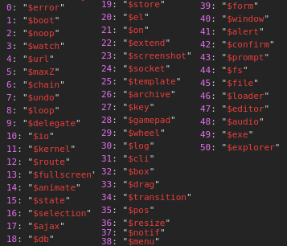

# Introduction

### Welcome to the Windows93 documentation site.

This website will allow for you to continuously learn about the Windows93 JavaScript documentation, as well as basic JavaScript knowledge.

### About the Apis

There are 51 APIs in Windows 93. Each of them begin with the dollar sign ($), except for the `system42` api.

### What other documentation sites are there?

* [https://yttriferous.dev/windows93-js-docs/old.html](https://yttriferous.dev/windows93-js-docs/old.html)
* [http://www.windows93.net/docs](http://www.windows93.net/docs)

As you can see above, there aren't many other documentation sites with in-depth information about Windows93. This documentation site strives to be the best out of all 3. Many pages made here are based on windows93.net/docs, which is open-sourced at [https://github.com/domenicw1/Win93\_JS\_Docs](https://github.com/domenicw1/Win93\_JS\_Docs).

### How can I contribute?

Know of any other documentation sites? Want to fix incorrect information? Need to write up a new page? Go ahead and open a pull request in [https://github.com/its-pablo/windows93-docs](https://github.com/its-pablo/windows93-docs). Additionally, if you plan on contributing a lot, I can add you to the GitBook organization that way you can edit things using an actual GUI and not notepad :woozy\_face:

### What's this built on?

Thank you [Gitbook](http://www.gitbook.com) for hosting this site.
