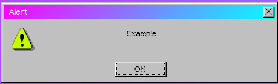

# $alert

### Examples

Shows an alert window that the user can close

### Usage

`$alert(options, callback)`

### Parameters

| Parameter | Type                                          | Remarks                                                                                                                                         |
| --------- | --------------------------------------------- | ----------------------------------------------------------------------------------------------------------------------------------------------- |
| options   | String or [WinObject](../window/winobject.md) | The text to display. Can also be a WinObject with a msg (and icon) property, to set more specific options. HTML is supported inside the string. |
| callback  | Function                                      | The callback for the function. Called with true if user presses OK.                                                                             |

### Sub

<table><thead><tr><th>Name</th><th data-type="select">Type</th><th>Description</th></tr></thead><tbody><tr><td><a href="sub/help.md">help</a></td><td></td><td>Shows an alert window against a white background that the user can close</td></tr><tr><td><a href="sub/error.md">error</a></td><td></td><td>TODO</td></tr><tr><td><a href="sub/progress.md">progress</a></td><td></td><td>TODO</td></tr><tr><td><a href="sub/info.md">info</a></td><td></td><td>TODO</td></tr></tbody></table>
