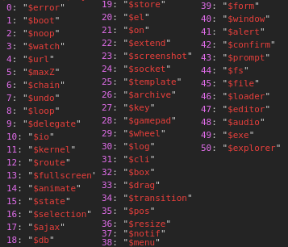

# $alert

### Examples

Shows an alert window that the user can close

### Usage

`$alert(options, callback)`

| Parameter | Type                | Remarks                                                                                                                                         |
| --------- | ------------------- | ----------------------------------------------------------------------------------------------------------------------------------------------- |
| options   | String or WinObject | The text to display. Can also be a WinObject with a msg (and icon) property, to set more specific options. HTML is supported inside the string. |
| callback  | Function            | The callback for the function. Called with true if user presses OK.                                                                             |

### Subfunctions

| Subfunction     | Description                                                              |
| --------------- | ------------------------------------------------------------------------ |
| [help](help.md) | Shows an alert window against a white background that the user can close |
| error           | TODO                                                                     |
| progress        | TODO                                                                     |
| info            | TODO                                                                     |
