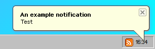

# $notif

### About

`$notif` is used for displaying notifications. Notifications appear naturally when deleting files or modifying them at the bottom right corner.

### Example







```javascript
$notif('An example notification', 'Test')
```



### Usage

`$notif(text, title)`

### Parameters

<table><thead><tr><th>Name</th><th data-type="select">Type</th><th>Description</th></tr></thead><tbody><tr><td><a href="params/text.md">text</a></td><td></td><td>The text to be displayed. Supports HTML.</td></tr><tr><td><a href="params/title.md">title</a></td><td></td><td>Title of notification, displays above and in bold</td></tr></tbody></table>

### Return

```javascript
function t(e, t) {
    "string" == typeof e && ("string" == typeof t ? (e = {
        title: e,
        text: t
    }, t = ) : e = {
        text: e
    });
    var n = $extend({}, h, e);
    t || (t = n.default);
    var i, d = n.dest;
    n.text = n.text || n.description || n.body || "";
    var o = t.getAttribute("data-js-notif-id");
    if (o) i = v[o];
    else {
        i = document.createElement("div"), d.appendChild(i), i.style.zIndex = 99999;
        var a = t.getBoundingClientRect();
        i.style.position = "fixed", i.style.bottom = window.innerHeight - ~~(a.top + a.height / 2) + "px", i.style.right = window.innerWidth - ~~(a.left + a.width / 2) + "px", t.setAttribute("data-js-notif-id", v.push(i) - 1)
    }
    var l = document.createElement("div"),
        u = document.createElement("b"),
        s = (a = document.createElement("p"), document.createElement("span"));
    l.style.visibility = "hidden", l.className = "ui_notif", s.innerHTML = "&times;";
    var c = 0;
    n.title && (u.innerHTML = n.title, l.appendChild(u), c += n.title.length), a.innerHTML = n.text, c += n.text.length, l.appendChild(a), l.appendChild(s), !(s.onclick = function() {
        p(l, !0)
    }) !== n.delay && (l.onmouseover = function() {
        clearTimeout(r)
    }, l.onmouseout = function() {
        f()
    }), setTimeout(function() {
        l.style.visibility = "visible", l.className = "ui_notif animated fadeIn"
    }, 100), i.appendChild(l), c /= 5;
    var r, m = n.speed || c / 3 * 1e3;

    function f() {
        r = setTimeout(function() {
            p(l)
        }, m + 2e3)
    }!1 !== n.delay && f()
}
```
