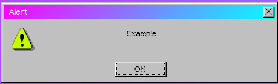

# $alert

### Examples

Shows an alert window that the user can close

### Usage

`$alert(options, callback)`

### Parameters

| Parameter                      | Type                                                                                                                 | Remarks                                                                                                                                         |
| ------------------------------ | -------------------------------------------------------------------------------------------------------------------- | ----------------------------------------------------------------------------------------------------------------------------------------------- |
| [options](broken-reference)    | String or [WinObject](https://github.com/its-pablo/windows93-docs/blob/main/dialog/alert/broken-reference/README.md) | The text to display. Can also be a WinObject with a msg (and icon) property, to set more specific options. HTML is supported inside the string. |
| [callback](params/callback.md) | Function                                                                                                             | The callback for the function. Called with true if user presses OK.                                                                             |

### Sub

<table><thead><tr><th>Name</th><th data-type="select">Type</th><th>Description</th></tr></thead><tbody><tr><td><a href="properties/help.md">help</a></td><td></td><td>Shows an alert window against a white background that the user can close</td></tr><tr><td><a href="properties/error.md">error</a></td><td></td><td>TODO</td></tr><tr><td><a href="broken-reference">progress</a></td><td></td><td>TODO</td></tr><tr><td><a href="broken-reference">info</a></td><td></td><td>TODO</td></tr></tbody></table>
