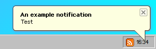

# $notif

### About

`$notif` is used for displaying notifications. Notifications appear naturally when deleting files or modifying them at the bottom right corner.

### Example

<!-- tabs:start -->
#### **Screenshot**


#### **Code**
```javascript
$notif('An example notification', 'Test')
```

OR

```javascript
$notif({
    title: "Test",
    text: "An example notification"
})
```

<!-- tabs:end -->

### Usage

`$notif(text, title)`

### [Arguments](args/)

| Name | Type            | Description                                                                                                        |
|------|-----------------|--------------------------------------------------------------------------------------------------------------------|
| opt  | object \| string | Object with known properties or text/HTML to be displayed                                                          |
| el   | object \| string | Element object (where the notif will be displayed) OR the title of the notification (only if opt is a string/HTML) |
