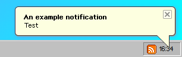

# Github


This page is intended to be viewed on the [Github repo](https://github.com/its-pablo/windows93-docs), and not the actual docs site.


I'm still not 100% sure how contributing on Github works with Gitbook, but do feel free to contribute if you find any information outdated or incorrect, or if you just want to add a new page.

Assets are stored in [this folder](https://github.com/its-pablo/windows93-docs/tree/main/.gitbook/assets), and a sitemap is automatically created [here](../SUMMARY.md).

When contributing, remember to always start a pull request and _never_ push to the `main` branch.

Large and small contributions are appreciated, so please don't hesitate to open an issue asking any questions you may have about the docs or Windows93 itself!

### Guide to creating new pages

New pages should follow the same consistent design as level 2 headers (##):

* Screenshot examples
* Code examples\*
* Usage\*
* Subfunctions, etc\*

Screenshot examples and code examples are allowed to be contributed as tabs: Here is how they should look:







```javascript
$alert('Example');
```



