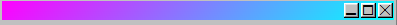
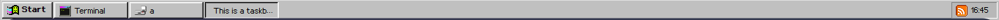

# Terminology

### Windows93 terminology

*   Status bar: top of the window

    
*   Taskbar: bottom of screen

    
*   Start button: bottom left of screen

    
*   Explorer: file explorer window - NOT the Cat Explorer app

    

### JS terminology

* Sub, or properties: items inside an object
* Method: function
